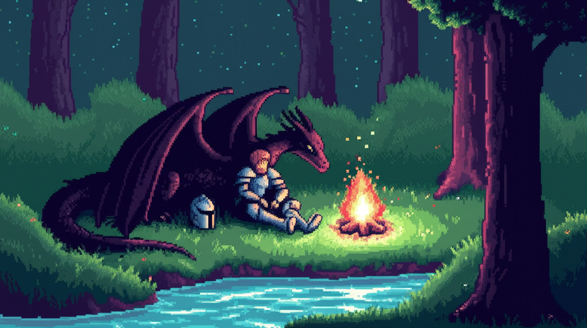
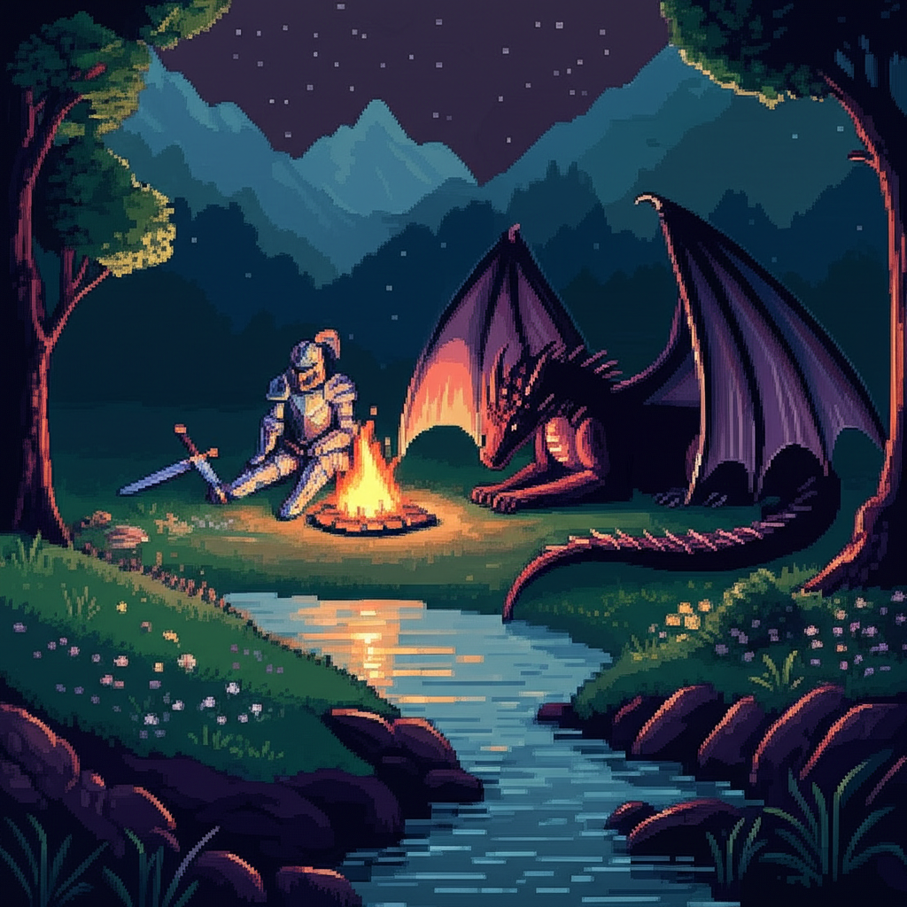
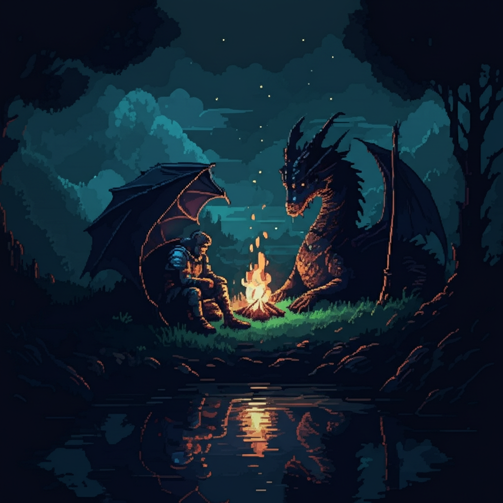
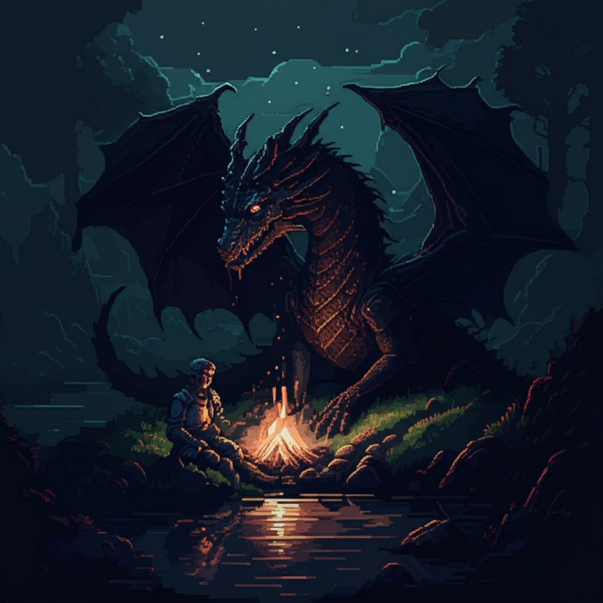

# AI-Powered Image Prompt Enhancer and Generator

## Overview

This project is an AI-powered tool that enhances user-provided image generation prompts using OpenAI's GPT and Google's GenAI models. The goal is (I guess) when you're searching data for small project let's say you want to train a diffusion model to generate pixel art but you couldn't find dataset so sampling a bit with this workflow you can easily get desired dataset. To support more creativity prompt enhancements are being made for each image generation.

Based on recent advancements in image generation Google's Gemini model seems to outperform other models.

### Here are some samples:

prompt: a knight resting next to river with a black dragon at night with campfire pixel art

**Enhanced prompt (openAI):**

A pixel art scene depicting a valiant knight clad in intricately detailed armor, resting beside a gently flowing river under a starlit night sky. The knight sits at ease, his helmet placed beside him on the soft grass. Nearby, a majestic black dragon with shimmering scales rests peacefully, its eyes reflecting the flickering light of a crackling campfire. The fire casts a warm glow, illuminating the knight's face and creating dancing shadows on the dragon's sleek body. The night sky above is dotted with sparkling stars and a crescent moon, adding a touch of magic to this tranquil scene. The river reflects the celestial light, creating a serene and enchanting atmosphere.

**Enhanced prompt (GenAI):**

Imagine a scene rendered in vibrant pixel art: A battle-worn knight, clad in tarnished steel armor, rests wearily upon a mossy riverbank beneath a vast, ink-black night sky dusted with a million shimmering stars. Beside him, a magnificent black dragon with scales like polished obsidian and eyes like molten gold reclines, its massive form casting a long shadow in the flickering firelight. A small campfire crackles merrily between them, casting a warm, orange glow that dances across the knight's tired face and the dragon's watchful gaze, illuminating the silent understanding between warrior and beast in this tranquil nighttime respite. This scene should be crafted with bold, chunky pixels, evoking a nostalgic, retro gaming aesthetic.

| OpenAI prompted Image 1                        | OpenAI prompted Image 2                        |
| ---------------------------------------------- | ---------------------------------------------- |
|  |  |

| GenAI prompted Image 1                       | GenAI prompted Image 2                       |
| -------------------------------------------- | -------------------------------------------- |
|  |  |

## Features

- **Prompt Enhancement**: Uses OpenAI's GPT and Google's Gemini to improve the quality of user-provided prompts.
- **Image Generation**: Generates images from the enhanced prompts using Google's Gemini model.
- **Modular Code Structure**: The project is divided into multiple modules for better maintainability and scalability.

## Technologies Used

- **Programming Language**: Python
- **AI Models**:
  - OpenAI's GPT-4o (for prompt enhancement)
  - Google's Gemini 2.0 Flash (for prompt enhancement and image generation)
- **Libraries**:
  - `openai` for interacting with OpenAI's API
  - `google.genai` for working with Google's AI models
  - `pydantic` for input validation
  - `PIL` (Pillow) for image handling
  - `dotenv` for managing API keys

## Project Structure

```
project/
│── main.py                # Entry point of the application
│── config.py              # Configuration file for API keys and model settings
│── models.py              # Pydantic data models for input validation
│── prompt_enhancer.py     # Enhances prompts using OpenAI and Gemini
│── image_generator.py     # Generates images using enhanced prompts
│── utils.py               # Helper functions (if needed)
│── requirements.txt       # List of dependencies
│── .env                   # Stores API keys (not included in version control)
```

## Installation

### 1. Clone the repository

```sh
git clone https://github.com/z3lka/image_generator.git
cd image_generator
```

### 2. Create and activate a virtual environment

```sh
python -m venv venv
source venv/bin/activate  # On macOS/Linux
venv\Scripts\activate    # On Windows
```

### 3. Install dependencies

```sh
pip install -r requirements.txt
```

### 4. Set up API keys

Create a `.env` file in the root directory and add your API keys:

```
OPENAI_API_KEY=your_openai_api_key
GOOGLE_API_KEY=your_google_api_key
```

## Usage

### 1. Run the application

```sh
python main.py
```

### 2. Provide a prompt

The program will prompt you to enter an image generation prompt. For example:

```
Enter a prompt: A futuristic city skyline at sunset
```

### 3. Select save locations (optional)

The application will ask where to save the generated images. If you press enter, it defaults to predefined locations:

```
Enter save location (default './images/openai'):
Enter save location (default './images/genai'):
```

### 4. View the results

- The tool enhances the prompt using OpenAI and Gemini.
- Images are generated and saved to the specified locations.
- The enhanced prompts are displayed in the terminal.

## Example Output

```
Enhanced Prompt (OpenAI): A breathtaking futuristic city skyline glowing with neon lights, under a dramatic sunset with towering skyscrapers and flying vehicles.

Enhanced Prompt (GenAI): A hyper-realistic futuristic city with a cyberpunk aesthetic, holographic advertisements reflecting on glass buildings, and a sunset casting long shadows over a bustling metropolis.

Image saved to: ./images/openai/image_1.png
Image saved to: ./images/genai/image_2.png
```

## Error Handling

- If an invalid prompt is provided, the program will alert the user and request a valid input.
- If API calls fail, the program falls back to the original prompt.
- If an image fails to generate, a message is displayed instead of crashing the program.

## Future Improvements

- **GUI Integration**: Implement a web or desktop interface for easier interaction.
- **More Image Generation Models**: Expand support for additional AI models.

## License

This project is licensed under the MIT License.

## Contributing

Contributions are welcome! To contribute:

1. Fork the repository
2. Create a new branch (`feature-new-feature`)
3. Commit your changes
4. Push to your branch
5. Submit a pull request

## Author

Developed by z3lka
